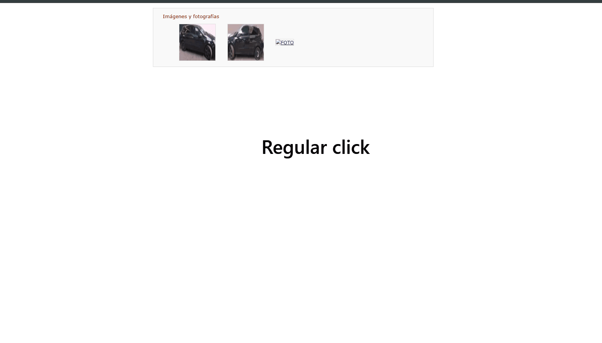

# Ctrl-Peek

> View full-resolution images that a website forces you to download. They open in-memory, with nothing saved to disk. Just **Ctrl-click**.

A tiny Chrome / Edge / Brave extension (Manifest V3).

## The problem

Some sites serve their images with the HTTP header `Content-Disposition: attachment`. That header tells the browser *"don't display this, download it."* So clicking an image, even just to glance at it, drops a file in your Downloads folder instead of opening it.

I ran into this on a public asset-auction portal: the thumbnails were small, low-resolution previews, and the only way to see a photo at full resolution was to let it download. Tedious when you're browsing a dozen listings and just want to *look*.

Ctrl-Peek intercepts the click, fetches the image itself, and shows it full-size in an overlay that lives in memory and is never written to disk.

## Demo



<!-- Record a ~3s clip: Ctrl-click a thumbnail, the full-res image pops up, Esc to close. -->

## Usage

1. Hold **Ctrl** (or **Cmd** on macOS) and click any image or thumbnail.
2. The full-resolution image opens centered in an overlay. The bottom shows its real pixel dimensions, so you can confirm it's the actual image and not the thumbnail.
3. Click anywhere or press **Esc** to close. The image is dropped from memory on close.

Normal (non-Ctrl) clicks are left untouched. If you actually want the file downloaded, click as usual.

## How it works

The key insight: `Content-Disposition: attachment` only controls what the *browser* does when it navigates to a URL. If you fetch the bytes yourself and render them, the header is irrelevant.

1. On a real Ctrl-click (synthetic clicks dispatched by the page are ignored), the content script cancels the default action (the forced download or new tab) and resolves the target URL, preferring the `<a href>` that wraps a thumbnail, since that's usually the full-resolution original. Only `http(s)` URLs are accepted.
2. It opens an overlay containing an iframe with the extension's own `viewer.html`. The viewer fetches the image with `host_permissions`, so CORS doesn't get in the way.
3. The viewer only accepts `image/*` (or `application/octet-stream`, which many forced-download sites use), caps the size at 100 MB, and puts the bytes into an `` as a `blob:` URL.

**Why an iframe:** the viewer runs on the extension's origin, not the website's. The page can't read what's inside it, so a malicious site can't use Ctrl-Peek to read data from other sites where you're logged in, even if it controls the link you clicked.

An `` only ever *decodes* bytes as an image; it never executes them, so a file carrying hidden code can't run through this path. On close, the iframe is removed, which frees the image and its `blob:` URL. Opening and closing many images doesn't accumulate memory.

## Limitations

- It assumes the full-resolution image is reachable from the clicked URL (typically the `<a href>` around the thumbnail). If a site triggers its download through JavaScript rather than a plain link, Ctrl-Peek grabs whatever URL it can find, which might be just the thumbnail. The URL it requests is logged to the console (`F12`, then Console) so you can verify.
- It's intentionally small and general. It doesn't special-case every site; it handles the common *"link to an image that downloads"* pattern well.
- Image-decoder vulnerabilities (rare, such as the 2023 libwebp issue) apply to **any** image your browser renders, not just this extension, so keep your browser up to date.

## Install (Chrome / Edge / Brave)

Not on the Web Store; load it unpacked:

1. Download or clone this repo.
2. Open `chrome://extensions`.
3. Enable **Developer mode** (top right).
4. Click **Load unpacked** and select the project folder.
5. Reload your target page and try Ctrl-click.

## Project structure

```
manifest.json   MV3 manifest: permissions and registration
content.js      intercepts Ctrl-click, resolves the URL, opens the overlay
content.css     overlay styling
viewer.html     isolated viewer (extension origin) shown inside the overlay
viewer.js       fetches the image, validates type and size, displays it
viewer.css      viewer / lightbox styling
```

## Privacy & permissions

The extension requests broad host access because it can run on any site where you Ctrl-click. It does **not** send anything to any external server: a fetch happens only on a real Ctrl-click by you, only to the URL you clicked, and the result only ever lands in an `` inside the isolated viewer, which the website can't read and which is discarded when you close it. All the code lives in this repo and is short enough to read end to end.

## Changelog

### 1.1
- **Security fix:** a malicious page could fake a Ctrl-click and use the extension to read data from other sites where you're logged in. The viewer now runs in an isolated extension iframe the page can't read, synthetic clicks are ignored, and only image responses up to 100 MB are accepted. **Update if you installed 1.0.**

### 1.0
- Initial release.

## License

[MIT](LICENSE)
